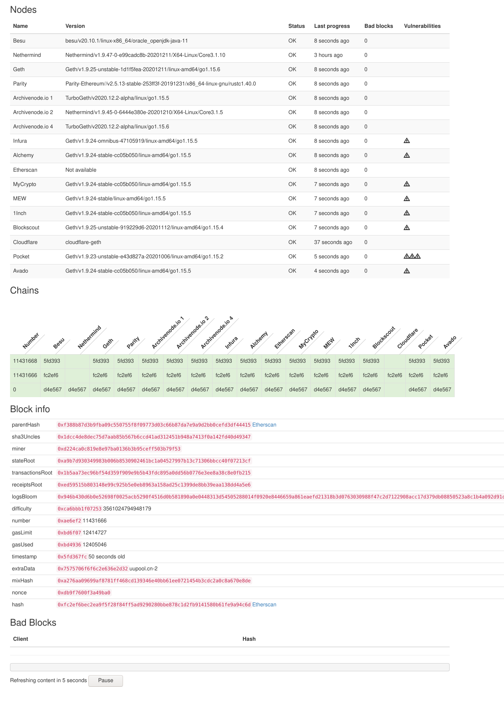
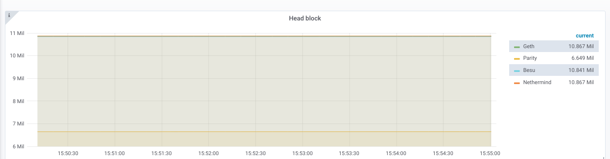

## Node monitor

This is a little tool to keep track on a set of nodes, 
and see if they keep in step or if they go out of consensus. 

## Usage
1. Copy the `config.example.toml` into a `config.toml` file and fill in the required information
2. with Docker: `docker run -d --name nodemonitor -p 8080:8080 -v <path-to-config.toml>/config.toml:/config.toml holiman/nodemonitor:latest /config.toml`
3. Access the webpage by navigating to `http://localhost:8080`

## Dashboard

It shows a neat little dashboard, where 'interesting' points of differing opinions are shown: 

## Metrics

It also has support for pushing metrics to `influxdb`, so you can get nice charts and 
alerts from all/any node which supports basic set of standard rpc methods. 

#command from satya for deployemnet on server

[1:41 pm, 29/7/2024] Satyasai Devloper India: sudo apt install apt-transport-https ca-certificates curl software-properties-common
[1:41 pm, 29/7/2024] Satyasai Devloper India: curl -fsSL https://download.docker.com/linux/ubuntu/gpg | sudo gpg --dearmor -o /usr/share/keyrings/docker-archive-keyring.gpg
[1:42 pm, 29/7/2024] Satyasai Devloper India: echo "deb [arch=amd64 signed-by=/usr/share/keyrings/docker-archive-keyring.gpg] https://download.docker.com/linux/ubuntu $(lsb_release -cs) stable" | sudo tee /etc/apt/sources.list.d/docker.list > /dev/null
[1:43 pm, 29/7/2024] Satyasai Devloper India: sudo apt install docker-ce docker-ce-cli containerd.io
[1:43 pm, 29/7/2024] Satyasai Devloper India: sudo docker run hello-world
[1:45 pm, 29/7/2024] Satyasai Devloper India: docker --version
[1:58 pm, 29/7/2024] Satyasai Devloper India: docker run -d --name nodemonitor -p 8080:8080 -v <path-to-config.toml>/config.toml:/config.toml holiman/nodemonitor:latest /config.toml
[1:59 pm, 29/7/2024] Satyasai Devloper India: docker run -d --name nodemonitor -p 8080:8080 -v ./config.toml:/config.toml holiman/nodemonitor:latest /config.toml
[2:12 pm, 29/7/2024] Satyasai Devloper India: docker restart nodemonitor
[2:15 pm, 29/7/2024] Satyasai Devloper India: docker stop nodemonitor
[2:17 pm, 29/7/2024] Satyasai Devloper India: docker rm -f nodemonitor
